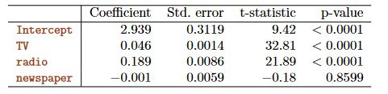

```{r setup, include=FALSE}
knitr::opts_chunk$set(echo = TRUE)
library(ISLR)
library(MASS)
```
&nbsp;

## 3. Linear Regression - Exercises  

&nbsp;

### Conceptual  

&nbsp;

#### **1.** Describe the null hypothesis to which the p-values given in Table 3.4 correspond. Explain what conclusions you can draw based on these p-values. Your explanation should be phrased in terms of sales, TV, radio, and newspaper, rather than in terms of the coefficients of the linear model.  


   

&nbsp;

The null hypothesis states that neither TV, radio and newspaper have a relationship with the response variable sales. Given the low p-values of TV and radio there is a relationship between these two variables and sales therefore we can reject the null hypothesis and accept the alternative hypothesis. Newspaper has no influence on sales given that the two other predictors are present.

&nbsp;


#### **2. **Carefully explain the differences between the KNN classifier and KNN regression methods.


In case of a classification setting (qualitative response) the KNN classifier identifies the K nearest neighbors of x<sub>0</sub> and then assigning it to the class with the higher probability. The KNN in a regression setting (quantitative response) on the other hand estimates f(x<sub>0</sub>) using the average of the K nearest training responses.

&nbsp;


#### **3.** Suppose we have a data set with five predictors, X<sub>1</sub>=GPA, X<sub>2</sub>=IQ, X<sub>3</sub>= Gender (1 for Female and 0 for Male),  X<sub>4</sub>= Interaction between GPA and IQ, and X<sub>5</sub>= Interaction between GPA and Gender. The response is starting salary after graduation (in thousands of dollars). Suppose we use least squares to fit the model, and get 
#### $\hat{\beta_{0}}$=50, $\hat{\beta_{1}}$=20, $\hat{\beta_{2}}$=0.07, $\hat{\beta_{3}}$=35, $\hat{\beta_{4}}$=0.01, $\hat{\beta_{5}}$=−10.


  (a) Which is correct, and why?
  
  &ensp;&ensp;&ensp;&ensp;&ensp;female: $salary_{i}$ = 85 + 10 x GPA + 0.07 x IQ + 0.01 x(GPA x IQ)  
  &ensp;&ensp;&ensp;&ensp;&ensp;male: $salary_{i}$ = 50 + 20 x GPA + 0.07 x IQ + 0.01 x(GPA x IQ)  
  
  &ensp;&ensp;&ensp;&ensp;&ensp;50 + 20 x GPA $\geq$ 85 + 10 x GPA for GPA $\geq$ 3.5
  
  
  
  i. For a fixed value of IQ and GPA, males earn more on average than females. **FALSE**
  ii. For a fixed value of IQ and GPA, females earn more on average than males. **FALSE**
  iii. For a fixed value of IQ and GPA, males earn more on average than females provided that the GPA is high enough. **TRUE**
  iv. For a fixed value of IQ and GPA, females earn more on average than males provided that the GPA is high enough. **FALSE**
  
  (b) Predict the salary of a female with IQ of 110 and a GPA of 4.0.
  
  &ensp;&ensp;&ensp;&ensp;&ensp;$salary_{i}$ = 85 + 10 x 4 + 0.07 x 110 + 0.01 x(4 x 110) = 137.1
  
  &ensp;&ensp;&ensp;&ensp;&ensp;The predicted salary is 137100 $.
  
  (c) True or false: Since the coefficient for the GPA/IQ interaction term is very small, there is very little evidence of an interaction effect. Justify your answer.
  
 &ensp;&ensp;&ensp;&ensp;&ensp; False. Cannot conclude that there is little evidence based on the given information. P-value and associated test statistic are needed to draw a conclusion.
 
 &nbsp;
 
#### **4.** I collect a set of data (n= 100 observations) containing a single predictor and a quantitative response. I then fit a linear regression model to the data, as well as a separate cubic regression.


  (a) Suppose that the true relationship between X and Y is linear, i.e. ${Y=\beta_{0}+\beta_{1}}{X_{1}} + {\epsilon}$. Consider the training residual sum of squares (RSS) for the linear regression, and also the training RSS for the cubic regression. Would we expect one to be lower than the other, would we expect them to be the same, or is there not enough information to tell? Justify your answer.
  
  In general the more flexible polynomial regression should have a lower RSS than the linear fit on the training data even if the underlying relationship is linear.
  
  (b) Answer (a) using test rather than training RSS.
  
  In the case of test data the linear regression should perform better(lower RSS) than the polynomial regression due to overfitting of the training data.
  
  (c) Suppose that the true relationship between X and Y is not linear, but we don’t know how far it is from linear. Consider the training RSS for the linear regression, and also the training RSS for the cubic regression. Would we expect one to be lower than the other, would we expect them to be the same, or is there not enough information to tell? Justify your answer. 
  
  The more flexible polynomial regression should have a lower RSS than the linear fit on the training data, especially if the underlying relationship is not linear.
  
  (d) Answer (c) using test rather than training RSS.
  
  We don't have enough information to answer this question. If the the true relationship is close to linear the linear regressiopn sould perfom better on the test data. If the underlying relationship is far from linear than the polynomial(cubic) approach should perform better.
  
 &nbsp;
 
#### **5.** Consider the fitted values that result from performing linear regression without an intercept. In this setting, the i-th fitted value takes the form

&nbsp;

$$\hat y_i = x_i\hat\beta$$
where

 $$\hat\beta =  \frac{\sum_{i=1}^{n}\left ( x_{i} y_{i} \right )}{\sum_{i'=1}^{n} x_{i'}^{2}}$$
show that we can write

$$\hat{y}_{i} = \sum_{i'=1}^{n}a_{i'}y_{i'}$$
What is $$a_{i'}$$ ?

&nbsp;
&nbsp;
&nbsp;

$$\hat y_i = x_i \Big( \frac{\sum_{j=1}^{n} x_j y_j }{\sum_{k=1}^{n} x_k^2} \Big) = \Bigg [ \sum_{j} \Big( \frac {x_ix_j}{\sum_{k}x_k^2} \Big )\Bigg ]y_j$$

$$a_j= \frac {x_ix_j}{\sum_{k}x_k^2}$$  
&nbsp;

  
#### **6.** Using (3.4), argue that in the case of simple linear regression, thje least squares line always passes through the point $(\bar{x},\bar{y})$
  
&nbsp;
  
We can work with the following two equations:

The simple linear regression equation:
$$y = \hat\beta_0+\hat\beta_1x $$ 
and equation 3.4 in the book:
$$\hat\beta_0 = \bar{y} - \hat\beta_1\bar{x}$$ 

  
  
So let's substitute $\bar{x}$ for x in the first equation. Then substitute the second equation for $\hat\beta_0$.

$$y = \bar{y} - \hat\beta_0\bar{x}+ \hat\beta_0\bar{x}$$
 $$y = \bar{y}$$ 
  
&nbsp;

#### **7.** skipped

&nbsp; 
 
### Applied 

&nbsp;

#### **8.** This question involves the use of simple linear regression on the Autodata set.
  
  (a) Use the lm() function to perform a simple linear regression with mpg as the response and horsepower as the predictor. Use the summary() function to print the results. Comment on the output. For example:
  
```{r, warning=FALSE, message=FALSE}
Auto = read.csv("Auto.csv", na.strings = "?")
Auto = na.omit(Auto)
attach(Auto)
lm.fit = lm(mpg~horsepower)
summary(lm.fit)
```

  i. Is there a relationship between the predictor and the response?
  With a very high F-statistic and a very low corresponding  p-value we can reject the null hypothesis $H_0: \beta_1 = 0$ in favor of the alternative hypothesis. A relationship between mpg and horsepower exists.
  
  ii. How strong is the relationship between the predictor and the response?
  With a R² of 0.6 horsepower explaines 60% of the variance in mpg which is a strong relationship.
  
  iii. Is the relationship between the predictor and the response positive or negative?
  With a coefficiant of -0.16 the relationship is negative. A 1 unit increase in horsepower results in a -0.16 decrease in mpg.
  
  iv. What is the predicted mpg associated with a horsepower of 98? What are the associated 95 % confidence and prediction intervals?
```{r} 
predict(lm.fit, data.frame(horsepower=c(98)), interval="confidence")
predict(lm.fit, data.frame(horsepower=c(98)), interval="prediction")

```
  
  (b) Plot the response and the predictor. Use the abline() function to display the least squares regression line.
 
  
```{r} 
plot(horsepower,mpg)
abline(lm.fit)

``` 
  
  (c) Use the plot() function to produce diagnostic plots of the least squares regression fit. Comment on any problems you see with the fit.
  
```{r} 
par(mfrow=c(2,2))
plot(lm.fit)

```   
  
   * relationship slightly non-linear
   * funnel shape of the residuals vs. fitted values plot indicates heteroscedasticity, response should be log transformed 

&nbsp;
  
#### **9.** This question involves the use of multiple linear regression on the Auto data set.  
  
&nbsp;

  (a) Produce a scatterplot matrix which includes all of the variables in the data set.
```{r}
pairs(Auto)

```  
  
  (b) Compute the matrix of correlations between the variables using the function cor(). You will need to exclude the name variable, which is qualitative.
```{r}
cor(Auto[1:8])

```
  (c) Use the lm() function to perform a multiple linear regression with mpg as the response and all other variables except name as the predictors. Use the summary() function to print the results. Comment on the output.
```{r}
lm.fit = lm(mpg~.-name, data=Auto)
summary(lm.fit)

```  
  i. Is there a relationship between the predictors and the response?  
  There is clear evidence of a relationship. With an F-statistic of 252.4 and a very low p-value we have enough evidence to reject $H_0$ in favor of the alternative hypothesis.  
  
  ii. Which predictors appear to have a statistically significant relationship to the response?  
  Weight, year, origin are statistically significant on the 0.001 level and displacement is stat. sig. on the 0.01 level.  
  
  iii. What does the coefficient for the year variable suggest?
  Year and mpg have a positive relationship. A one unit increase in year results in a 0.75 increase in mpg.
  
  (d) Use the plot() function to produce diagnostic plots of the linear regression fit. Comment on any problems you see with the fit. Do the residual plots suggest any unusually large outliers? Does the leverage plot identify any observations with unusually high leverage?
```{r}
par(mfrow = c(2, 2))
plot(lm.fit)
```  
  * evidence of non-linearity
  * observation 14 has somewhat high leverage but within the boundary defined by $(p+1)/n = (7+1)/ 392 = 0.02$
  * funnel shape of the residuals vs. fitted values plot indicates heteroscedasticity, response should be log transformed
  
  (e) Use the * and : symbols to fit linear regression models with interaction effects. Do any interactions appear to be statistically significant?
```{r}
lm.fit2 = lm(mpg~ year*origin, data=Auto)
summary(lm.fit2)
lm.fit3 = lm(mpg~ weight*year, data=Auto)
summary(lm.fit3)
lm.fit4 = lm(mpg~ year*displacement, data=Auto)
summary(lm.fit4)

```
year:displacement and weight:year seem to be statistically significant.


  (f) Try a few different transformations of the variables, such as $log(X)$, $√X$, $X^2$. Comment on your findings.
```{r}
fit.lm4 = lm(mpg~weight+year+origin, data=Auto)
summary(fit.lm4)
fit.lm5 = lm(mpg~I(log(weight))+year+origin, data=Auto)
summary(fit.lm5)
fit.lm6 = lm(mpg~I(weight^2)+year+origin, data=Auto)
summary(fit.lm6)

```


  * based on the F-statistic the model with log(weight) outperforms the others

&nbsp;

#### **10.** This question should be answered using the Carseats data set.  
  
&nbsp;

  
  (a) Fit a multiple regression model to predict Sales using Price, Urban, and US. 
  
```{r}
data(Carseats)
car1_fit = lm(Sales~Price+Urban+US, data=Carseats)
summary(car1_fit)
```

  (b) Provide an interpretation of each coefficient in the model. Be careful some of the variables in the model are qualitative!
  * A 1 unit increase in Price results in a 0.054 und decrease in Sales
  * if Urban = Yes, Sales decrease by 0.021
  * if US = Yes, Sales increase by 1.2
  (c) Write out the model in equation form, being careful to handle the qualitative variables properly.
  
  $$Sales= 13.043469 - 0.054459\times Price - 0.021916 \times Urban + 1.200573 \times US $$
  
  (d) For which of the predictors can you reject the null hypothesis $H_0: \beta_j = 0$?
  You can reject the null hypothesis for US and Price
  (e) On the basis of your response to the previous question, fit a smaller model that only uses the predictors for which there is evidence of association with the outcome.
  
```{r}

car2_fit = lm(Sales~Price+US, data=Carseats)
summary(car2_fit)
```

  
  (f) How well do the models in (a) and (e) fit the data?
  The R² is almost the same for both models but the second  model has a slightly better RSE than the first model. 23.9% of the variance in the response variable are explained by the model. 
  (g) Using the model from (e), obtain 95 % confidence intervals for the coefficient(s).
  
```{r}
confint(car2_fit)
```  
  
  (h) Is there evidence of outliers or high leverage observations in the model from (e)?
  
  
```{r}
par(mfrow = c(2, 2))
plot(car2_fit)
```
  
&nbsp;
  
  * relationship seems linear  
  * $(p+1)/n = (2+1)/ 400 = 0.0075$ there are several high leverage points in our model

```{r}
plot(predict(car1_fit), rstudent(car1_fit))
```  
  
  * no outliers here since no value exceeds +-3  
  
&nbsp;

#### **11.** In this problem we will investigate the t-statistic for the null hypothesis H0:β= 0 in simple linear regression without an intercept. To begin, we generate a predictor x and a response y as follows.  

&nbsp;

```{r}
set.seed(1)
x=rnorm(100)
y=2*x+rnorm(100)

```

  (a) Perform a simple linear regression of y onto x, without an intercept. Report the coefficient estimate $\hat\beta$, the standard error of this coefficient estimate, and the t-statistic and p-value associated with the null hypothesis $H_0:\beta= 0$. Comment on these results. (You can perform regression without an intercept using the command lm(y∼x+0).)
  
```{r}
lm.fit = lm(y∼x+0)
summary(lm.fit)
``` 

  (b) Now perform a simple linear regression of x onto y without an intercept, and report the coefficient estimate, its standard error,and the corresponding t-statistic and p-values associated with the null hypothesis $H_0:\beta= 0$. Comment on these results.
```{r}
lm.fit = lm(x∼y+0)
summary(lm.fit)
``` 
 
  * the only thing that changes is the residual error
  
  (c) What is the relationship between the results obtained in (a) and (b)?
  (d) For the regression of Y onto X without an intercept, the t-statistic for $H_0: \beta =0$ takes the form $\hat\beta / {SE\hat\beta}$, where $\hat\beta$ is given by (3.38), and where
  $SE(\beta) = \sqrt{\frac {\sum{(y_i - x_i \beta)^2}} {(n-1) \sum{x_i^2}}}$
  (These formulas are slightly different from those given in Sections 3.1.1 and 3.1.2, since here we are performing regression without an intercept.) Show algebraically, and confirm numerically in R, that the t-statistic can be written as
$$t = \frac {\sqrt{n-1} \sum{x_i y_i}} 
          {\sqrt{\sum{x_i^2} \sum{y_i^2} - (\sum{x_i y_i})^2 }}$$ 
          
$$t = \beta / SE(\beta)  \\
  \beta = \frac {\sum{x_i y_i}} {\sum{x_i^2}} \\
  SE(\beta) = \sqrt{\frac {\sum{(y_i - x_i \beta)^2}} {(n-1) \sum{x_i^2}}}\\$$
  
$$
  t = {\frac {\sum{x_i y_i}} {\sum{x_i^2}}}
      {\sqrt{\frac {(n-1) \sum{x_i^2}} {\sum{(y_i - x_i \beta)^2}}}}
  \\
  t = {\frac {\sqrt{n-1} \sum{x_i y_i}}
        {\sqrt{\sum{x_i^2} \sum{(y_i - x_i \beta)^2}}}}
  \\
  t = {\frac {\sqrt{n-1} \sum{x_i y_i}}
        {\sqrt{\sum{x_i^2} \sum{(y_i^2 - 2 \beta x_i y_i  + x_i^2 \beta^2)}}}}
  \\
  t = {\frac {\sqrt{n-1} \sum{x_i y_i}}
        {\sqrt{\sum{x_i^2} \sum{y_i^2} - 
              \sum{x_i^2} \beta (2 \sum{x_i y_i} - \beta \sum{x_i^2})}}}
  \\
  t = {\frac {\sqrt{n-1} \sum{x_i y_i}}
        {\sqrt{\sum{x_i^2} \sum{y_i^2} - 
              \sum{x_i y_i} (2 \sum{x_i y_i} - \sum{x_i y_i})}}}
              \\
t = \frac {\sqrt{n-1} \sum{x_i y_i}} 
          {\sqrt{\sum{x_i^2} \sum{y_i^2} - (\sum{x_i y_i})^2 }} $$
          
```{r}
n = length(x)
t = sqrt(n - 1)*(x %*% y)/sqrt(sum(x^2) * sum(y^2) - (x %*% y)^2)
t
```
Which equals the t-value calculated by our model.
  
  
  (e) Using the results from (d), argue that the t-statistic for the regression of y onto x is the same as the t-statistic for the regression of x onto y.
  
  * it is easy to see in the formula below that if you replace $y_i$ for $x_i$ and $x_i$ for $y_i$ the results will stay the same.
  
$$t = \frac {\sqrt{n-1} \sum{x_i y_i}} 
          {\sqrt{\sum{x_i^2} \sum{y_i^2} - (\sum{x_i y_i})^2 }}$$

  
  (f) In R, show that when regression is performed with an intercept, the t-statistic for $H_0:\beta= 0$ is the same for the regression of y onto x as it is for the regression of x onto y.
  
  
```{r}
lm.fit = lm(y ~x)
summary(lm.fit)
lm.fit = lm(x ~ y)
summary(lm.fit)
```
 
&nbsp;

#### **12.** This problem involves simple linear regression without an intercept.
 
&nbsp;
 
  (a) Recall that the coefficient estimate $\hat\beta$ for the linear regression of Y onto X without an intercept is given by $\hat\beta =  \frac{\sum_{i=1}^{n}\left ( x_{i} y_{i} \right )}{\sum_{i'=1}^{n} x_{i'}^{2}}$. Under what circumstance is the coefficient estimate for the regression of X onto Y the same as the coefficient estimate for the regression of Y onto X? 
  * the coefficient estimate uis the same if ${\sum_{j=1}^{n} x_{j}^{2}} = {\sum_{j=1}^{n} y_{j}^{2}}$
  (b) Generate an example in R with n= 100 observations in which the coefficient estimate for the regression of X onto Y is different from the coefficient estimate for the regression of Y onto X.

```{r}
set.seed(1)
x = rnorm(100)
y = 2*x + rnorm(100)
fit.lmY = lm(y ~ x)
fit.lmX = lm(x ~ y)
summary(fit.lmY)
summary(fit.lmX)
```
  (c) Generate an example in R with n= 100 observations in which the coefficient estimate for the regression of X onto Y is the same as the coefficient estimate for the regression of Y onto X.


```{r}

set.seed(1)
x = rnorm(100)
y = -sample(x, 100)
sum(x^2)
sum(y^2)
lm.fit = lm(y~x+0)
lm.fit2 = lm(x~y+0)
summary(lm.fit)
summary(lm.fit2)
```

&nbsp;

#### 13. In this exercise you will create some simulated data and will fit simple linear regression models to it. Make sure to use set.seed(1) prior to starting part (a) to ensure consistent results.

&nbsp;

  (a) Using the rnorm() function, create a vector, x, containing 100 observations drawn from a $N(0,1)$ distribution. This represents a feature, $X$.
```{r}
set.seed(1)
x = rnorm(100)
```
  (b) Using the rnorm() function, create a vector, eps, containing 100 observations drawn from a N(0,0.25) distribution i.e. a normal distribution with mean zero and variance 0.25.
```{r}

eps = rnorm(100, sd = sqrt(0.25))
```
  (c) Using x and eps, generate a vector y according to the model $Y =  -1 + 0.5X + \epsilon$ (3.39). What is the length of the vector y? What are the values  of $\beta_0$ and $\beta_1$ in this linear model?
  
```{r}
y = -1 + (0.5*x) + eps
length(y)
```
  * $\beta_0 = -1$ and $\beta_1 = 0.5$
  
  (d) Create a scatterplot displaying the relationship between x and y. Comment on what you observe.
```{r}
plot(x, y)
```

&nbsp;

  * x and y are positively correlated

  (e) Fit a least squares linear model to predict y using x. Comment on the model obtained. How do $\hat\beta_0$ and $\hat\beta_1$ 1compare to $\beta_0$ and $\beta_1$?
```{r}
lm.fit1 = lm(y ~ x)
summary(lm.fit1)
```  
  
  &nbsp;
  
  * large F-statistic, $H_0$ rejected
  * betas are very close to each other
  
  (f) Display the least squares line on the scatterplot obtained in (d). Draw the population regression line on the plot, in a different color. Use the legend() command to create an appropriate legend.
```{r}
plot(x, y)
abline(lm.fit1, col = "blue")
abline(-1, 0.5, col = "red")
legend("topleft", c("model", "population"), col = c("blue", "red"), lty = c(1, 1))
```

&nbsp;
  
  (g) Now fit a polynomial regression model that predicts y using x and x². Is there evidence that the quadratic term improves the model fit? Explain your answer.
```{r}
lm.fit_sqrt = lm(y~x+I(x^2))
summary(lm.fit_sqrt)
```
  
  * x² is not stat. sig. so not enough evidence that polynomial term improves model.
  * changes in R² and RSE are negligible
  
  
  (h) Repeat (a)–(f) after modifying the data generation process in such a way that there is les snoise in the data. The model (3.39) should remain the same. You can do this by decreasing the variance of the normal distribution used to generate the error term in (b). Describe your results.
```{r}
eps2 = rnorm(100, sd=0.1)  
y2 = -1 + 0.5*x + eps2
lm.fit2 = lm(y2 ~ x)
summary(lm.fit2)
```
```{r}
plot(x, y2)
abline(lm.fit2, col = "blue")
abline(-1, 0.5, col = "red")
legend("topleft", c("model", "population"), col = c("blue", "red"), lty = c(1, 1))
```  
 
&nbsp;

  * variance decreases
  * minimal changes in coefficiantes result in way better R² and RSE values. 
  
  (i) Repeat (a)–(f) after modifying the data generation process in such a way that there is more noise in the data. The model(3.39) should remain the same. You can do this by increasing the variance of the normal distribution used to generate the error term in (b). Describe your results.
```{r}
eps2 = rnorm(100, sd=1)  
y2 = -1 + 0.5*x + eps2
lm.fit3 = lm(y2 ~ x)
summary(lm.fit3)
```
```{r}
plot(x, y2)
abline(lm.fit3, col = "blue")
abline(-1, 0.5, col = "red")
legend("topleft", c("model", "population"), col = c("blue", "red"), lty = c(1, 1))
```  

&nbsp;

  * variance increases
  * minimal changes in coefficiantes result in way worse R² and RSE values.


  (j) What are the confidence intervals for $\beta_0$ and $\beta_1$ based on the original data set, the noisier data set, and the less noisy dataset? Comment on your results.
  
```{r}
confint(lm.fit1)
confint(lm.fit2)
confint(lm.fit3)
```

  * the lower the variance the tighter the confidence interval  
  
&nbsp;

#### **14.** This problem focuses on the collinearity problem.

&nbsp;
  
  (a) Perform the following commands in R:
  
```{r}
set.seed(1)
x1 = runif(100)
x2 = 0.5 * x1 + rnorm(100)/10
y = 2 + 2 * x1 + 0.3 * x2 + rnorm(100)
```

  The last line corresponds to creating a linear model in which y is a function of x1 and x2. Write out the form of the linear model. What are the regression coefficients?

  * the model takes the form $Y = 2 + 2*X_1+ 0.3*X_2 + \epsilon$
  * the coefficiants are $\beta_0 = 2$, $\beta_1 = 2$ and $\beta_2 = 0.3$
  
  
  (b) What is the correlation between $X_1$and $X_2$? Create a scatterplot displaying the relationship between the variables.
  
```{r}
cor(x1, x2)
plot(x1, x2)
```
  
&nbsp;

  * the variables are highly correlated
  
   (c) Using this data, fit a least squares regression to predict $Y$ using $X_1$and $X_2$. Describe the results obtained. What are $\hat\beta_0$, $\hat\beta_1$,and $\hat\beta_2$? How do these relate to the true $\beta_0$, $\beta_0$, and $\beta_0$? Can you reject the null hypothesis $H_0:\beta_1= 0$? How about the null hypothesis $H_0:\beta_2= 0$?  
  
```{r}
lm.fit1 = lm(y~ x1 + x2)
summary(lm.fit1)
```
  
  * model betas are quite different with $\hat\beta_0$ being closed to the real $beta_0$
  * only $X_1$ is stat. sig. and $H_0$ can be rejected

  (d) Now fit a least squares regression to predict $Y$ using only $X_1$. Comment on your results. Can you reject the null hypothesis $H_0:\beta_1= 0$?  
  
```{r}
lm.fit2 = lm(y~ x1)
summary(lm.fit2)
```

  * as expected $X_1$ is now highly statistically significant on the 0.001 level and $\beta_0$ and $\beta_1$ are very close to the real betas
  * $H_0:\beta_1= 0$ can be rejected

  (e) Now fit a least squares regression to predict $Y$ using only $X_2$. Comment on your results. Can you reject the null hypothesis $H_0:\beta_2= 0$?

```{r}
lm.fit3 = lm(y~ x2)
summary(lm.fit3)
```  


  * $X_2$ is now statistically significant on the 0.001 level
  * can reject $H_0:\beta_2= 0$

  (f) Do the results obtained in (c)–(e) contradict each other? Explain your answer.
  
  * no since $X_1$ and $X_2$ are highly correlated (if $X_1$ increases $X_2$ increases) it is difficult for our model to seperate out their individual effect 
  
  (g) Now suppose we obtain one additional observation, which was unfortunately mismeasured. Re-fit the linear models from (c) to (e) using this new data. What effect does this new observation have on the each of the models? In each model, is this observation an outlier? A high-leverage point? Both? Explain your answers.

```{r}
x1 = c(x1, 0.1)
x2 = c(x2, 0.8)
y = c(y, 6)
par(mfrow=c(2,2))
# regression with both x1 and x2
lm.fit1 = lm(y~x1+x2)
summary(lm.fit1)
plot(lm.fit1)
# regression with x1 only
lm.fit2 = lm(y~x2)
summary(lm.fit2)
plot(lm.fit2)
# regression with x2 only
lm.fit3 = lm(y~x1)
summary(lm.fit3)
plot(lm.fit3)
```

&nbsp;

  * the new point is a high leverage point in every model, but only in model 1 it has a high impact on the regression line
  
&nbsp;

#### **15.** This problem involves the Boston data set, which we saw in the lab for this chapter. We will now try to predict per capita crime rate using the other variables in this data set. In other words, per capita crime rate is the response, and the other variables are the predictors.

&nbsp;

  (a) For each predictor, fit a simple linear regression model to predict the response. Describe your results. In which of the models is there a statistically significant association between the predictorand the response? Create some plots to back up your assertions.
```{r}
summary(Boston)
Boston$chas = factor(Boston$chas, labels = c("N","Y"))
summary(Boston)
attach(Boston)
lm.zn = lm(crim~zn)
summary(lm.zn) # yes
lm.indus = lm(crim~indus)
summary(lm.indus) # yes
lm.chas = lm(crim~chas) 
summary(lm.chas) # no
lm.nox = lm(crim~nox)
summary(lm.nox) # yes
lm.rm = lm(crim~rm)
summary(lm.rm) # yes
lm.age = lm(crim~age)
summary(lm.age) # yes
lm.dis = lm(crim~dis)
summary(lm.dis) # yes
lm.rad = lm(crim~rad)
summary(lm.rad) # yes
lm.tax = lm(crim~tax)
summary(lm.tax) # yes
lm.ptratio = lm(crim~ptratio)
summary(lm.ptratio) # yes
lm.black = lm(crim~black)
summary(lm.black) # yes
lm.lstat = lm(crim~lstat)
summary(lm.lstat) # yes
lm.medv = lm(crim~medv)
summary(lm.medv) # yes
```  

  * every predictor is significant but chas
  
  (b) Fit a multiple regression model to predict the response using all of the predictors. Describe your results. For which predictors can we reject the null hypothesis $H_0:\beta_j=0$?

```{r}
lm.all = lm(crim ~ ., data = Boston)
summary(lm.all)

```

  * We can reject the null hypothesis for medv, black, rad, dis and zn

  (c) How do your results from (a) compare to your results from (b)? Create a plot displaying the univariate regression coefficients from (a) on the x-axis, and the multiple regression coefficients from (b) on they-axis. That is, each predictor is displayed as a single point in the plot. Its coefficient in a simple linear regression model is shown on the x-axis, and its coefficient estimate in the multiple linear regression model is shown on the y-axis.
  
```{r}
x = c(coefficients(lm.zn)[2],
      coefficients(lm.indus)[2],
      coefficients(lm.chas)[2],
      coefficients(lm.nox)[2],
      coefficients(lm.rm)[2],
      coefficients(lm.age)[2],
      coefficients(lm.dis)[2],
      coefficients(lm.rad)[2],
      coefficients(lm.tax)[2],
      coefficients(lm.ptratio)[2],
      coefficients(lm.black)[2],
      coefficients(lm.lstat)[2],
      coefficients(lm.medv)[2])
y = coefficients(lm.all)[2:14]
plot(x, y)
```

  (d) Is there evidence of non-linear association between any of the predictors and the response? To answer this question, for each predictor $X$, fit a model of the form $Y = \beta_0 + \beta_1X+ \beta_2X^2+ \beta_3X^3+ \epsilon$


```{r}
lm.zn = lm(crim~poly(zn,3))
summary(lm.zn) # 1, 2
lm.indus = lm(crim~poly(indus,3))
summary(lm.indus) 
lm.nox = lm(crim~poly(nox,3))
summary(lm.nox) 
lm.rm = lm(crim~poly(rm,3))
summary(lm.rm) 
lm.age = lm(crim~poly(age,3))
summary(lm.age) 
lm.dis = lm(crim~poly(dis,3))
summary(lm.dis) 
lm.rad = lm(crim~poly(rad,3))
summary(lm.rad) 
lm.tax = lm(crim~poly(tax,3))
summary(lm.tax) 
lm.ptratio = lm(crim~poly(ptratio,3))
summary(lm.ptratio) 
lm.black = lm(crim~poly(black,3))
summary(lm.black) 
lm.lstat = lm(crim~poly(lstat,3))
summary(lm.lstat) 
lm.medv = lm(crim~poly(medv,3))
summary(lm.medv) 
```


  
  