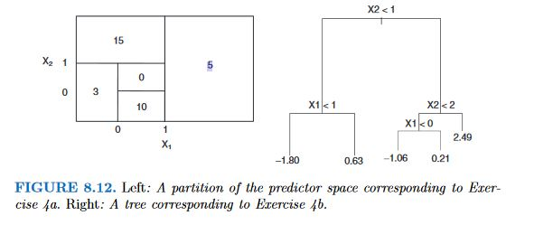
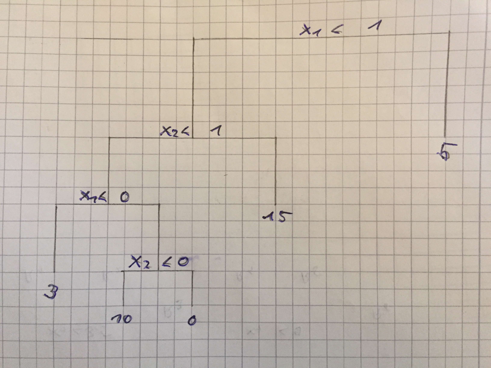

```{r setup, include=FALSE}
knitr::opts_chunk$set(echo = TRUE)
library(ISLR)
library(MASS)
```
&nbsp;&nbsp;

## 8. Tree-Based Methods 

&nbsp;

### Conceptual

&nbsp;


#### **1.** Draw an example (of your own invention) of a partition of two-dimensional feature space that could result from recursive binary splitting. Your example should contain at least six regions. Draw a decision tree corresponding to this partition. Be sure to label all aspects of your figures, including the regions R1,R2,..., the cutpoints t1,t2,..., and so forth.


&nbsp;


#### **2.** It is mentioned in Section 8.2.3 that boosting using depth-one trees (or stumps) leads to an additive model: that is, a model of the form  

$$f(X) = \sum_{j = 1}^p f_j(X_j)$$

#### Explain why this is the case. You can begin with (8.12) in Algorithm 8.2.

  * If d = 1 every term in $\widehat{f}(x) = \sum_{b=1}^{B} \lambda \widehat{f}^b(x)$ is based on a single predictor. All these terms are summed up making the model additive.

&nbsp;

  
#### **3.** Consider the Gini index, classification error, and entropy in a simple classification setting with two classes. Create a single plot that displays each of these quantities as a function of $\hat{p}_{m1}$. The x-axis should display $\hat{p}_{m1}$, ranging from 0 to 1, and the y-axis should display the value of the Gini index, classification error, and entropy.


```{r}
p = seq(0, 1, 0.01)
gini = p * (1 - p) * 2
entropy = -(p * log(p) + (1 - p) * log(1 - p))
class.err = 1 - pmax(p, 1 - p)
matplot(p, cbind(gini, entropy, class.err), type = "l", col = c("red", "green", "blue"))
legend("topright",legend=c("gini","entropy", "class error"),pch=19,col=c("red", "green", "blue"))
```


#### **4.** This question relates to the plots in Figure 8.12.



  (a) Sketch the tree corresponding to the partition of the predictor space illustrated in the lefthand panel of Figure 8.12. The numbers inside the boxes indicate the mean of Y within each region.


&nbsp;


  (b) Create a diagram similar to the left-hand panel of Figure 8.12, using the tree illustrated in the righthand panel of the same figure. You should divide up the predictor space into the correct regions, and indicate the mean for each region.


&nbsp;

#### **5.** Suppose we produce ten bootstrapped samples from a data set containing red and green classes. We then apply a classification tree to each bootstrapped sample and, for a specific value of X, produce 10 estimates of P(Class is Red|X) : 0.1, 0.15, 0.2, 0.2, 0.55, 0.6, 0.6, 0.65, 0.7, and 0.75. There are two common ways to combine these results together into a single class prediction. One is the majority vote approach discussed in this chapter. The second approach is to classify based on the average probability. In this example, what is the final classification under each of these two approaches?

  * majoritry vote: 6 vs 4 --> red
  * avg. prob.:  P(Class is Red|X) = 4.5/10 = 0.45 --> green

&nbsp;

  
#### **6.** Provide a detailed explanation of the algorithm that is used to fit a regression tree.

  * 1. Use recursive binary splitting to grow a large tree on the training data, stopping only when each terminal node has fewer than some minimum number of observations.
  * 2. Apply cost complexity pruning to the large tree in order to obtain a sequence of best subtrees, as a function of $\alpha$.
  * 3. Use K-fold cross-validation to choose $\alpha$. That is, divide the training observations into K-folds. For each K=1,...,K:
  (a) Repeat Steps 1 and 2 on all but the kth fold of the training data.
  (b) Evaluate the mean squared prediction error on the data in the left-out k-th fold, as a function of$\alpha$. Average the results for each value of $\alpha$, and pick $\alpha$ to minimize the average error.
  * 4. Return the subtree from Step 2 that corresponds to the chosen value of $\alpha$.
  
  
&nbsp;

### Applied

&nbsp;

#### **7.** In the lab, we applied random forests to the Boston data using mtry=6 and using ntree=25 and ntree=500. Create a plot displaying the test error resulting from random forests on this data set for a more comprehensive range of values form try and ntree. You can model your plot after Figure 8.10. Describe the results obtained.

```{r}
library(MASS)
library(randomForest)
set.seed(1101)
train = sample(1:nrow(Boston), nrow(Boston)/2)
X.train <- Boston[train, -14]
X.test <- Boston[-train, -14]
Y.train <- Boston[train, 14]
Y.test <- Boston[-train, 14]

p = dim(Boston)[2] - 1
p_2 = p/2
p.sqrt = sqrt(p)

forest.p = randomForest(X.train, Y.train, xtest=X.test, ytest=Y.test, mtry=p, ntree=500)
forest.p2 = randomForest(X.train, Y.train, xtest=X.test, ytest=Y.test, mtry=p_2, ntree=500)
forest.sqrt.p = randomForest(X.train, Y.train, xtest=X.test, ytest=Y.test, mtry=p.sqrt, ntree=500)

plot(1:500, forest.p$test$mse, col="green", type="l", xlab="Number of Trees", ylab="Test MSE", ylim=c(8, 19))
lines(1:500, forest.p2$test$mse, col="red", type="l")
lines(1:500, forest.sqrt.p$test$mse, col="blue", type="l")
legend("topright", c("m=p", "m=p/2", "m=sqrt(p)"), col=c("green", "red", "blue"), cex=1, lty=1)
```

  * test MSE decreases rapidly with more and more grown trees and flatens out after 100 trees
  * the model for all predictors has a way higher test MSE than the other two models

&nbsp;

#### **8.**  In the lab, a classification tree was applied to the “Carseats” data set after converting “Sales” into a qualitative response variable. Now we will seek to predict “Sales” using regression trees and related approaches, treating the response as a quantitative variable.


  
  (a) Split the data set into a training set and a test set.
  
```{r}
library(ISLR)
set.seed(3)
train = sample(dim(Carseats)[1], dim(Carseats)[1]/2)
Carseats.train = Carseats[train, ]
Carseats.test = Carseats[-train, ]
```


  (b) Fit a regression tree to the training set. Plot the tree, and interpret the results. What test MSE do you obtain?
  
```{r}
library(tree)
tree.carseats = tree(Sales ~ ., data = Carseats.train)
summary(tree.carseats)
```  
```{r}
plot(tree.carseats)
text(tree.carseats, pretty = 0)
```
```{r}
pred.carseats = predict(tree.carseats, Carseats.test)
mean((Carseats.test$Sales - pred.carseats)^2)
```

  (c) Use cross-validation in order to determine the optimal level of tree complexity. Does pruning the tree improve the test MSE?
```{r}
cv.carseats = cv.tree(tree.carseats, FUN=prune.tree)
par(mfrow=c(1, 2))
plot(cv.carseats$size, cv.carseats$dev, type="b")
plot(cv.carseats$k, cv.carseats$dev, type="b")
```  
```{r}
pruned.carseats = prune.tree(tree.carseats, best = 5)
par(mfrow = c(1, 1))
plot(pruned.carseats)
text(pruned.carseats, pretty = 0)
```

```{r}
pred.pruned = predict(pruned.carseats, Carseats.test)
mean((Carseats.test$Sales - pred.pruned)^2)
```
  (d) Use the bagging approach in order to analyze this data. What test MSE do you obtain? Use the importance() function to determine which variables are most important.
```{r}
library(randomForest)
set.seed(1)
bag.carseats = randomForest(Sales~., data=Carseats.train, mtry = 10, ntree = 500, importance=TRUE)
bag.carseats
```
```{r}
bag.pred = predict(bag.carseats, Carseats.test)
mean((Carseats.test$Sales - bag.pred)^2)
``` 
  
```{r}
importance(bag.carseats)
```
  
  * The most important variables are Price, ShelveLoc and CompPrice   
  
  (e) Use random forests to analyze this data. What test MSE do you obtain? Use the importance() function to determine which variables are most important. Describe the effect of m, the number of variables  considered  at  each  split,  on  the  error  rate obtained. 
  
  
```{r}
oob.err=double(10)
test.err=double(10)
for(mtry in 1:10){
  rf.carseats = randomForest(Sales ~ ., data = Carseats.train, mtry = mtry, ntree = 500, 
      importance = T)
  oob.err[mtry]=rf.carseats$mse[500]
  rf.pred = predict(rf.carseats, Carseats.test)
  test.err[mtry] = mean((Carseats.test$Sales - rf.pred)^2)
  cat(mtry," ")
}
matplot(1:mtry,cbind(test.err,oob.err),pch=19,col=c("red","blue"),type="b",ylab="Mean Squared Error")
```  

  * test MSE falls fast til mtry = 6 (6 variables considered at each split) and then levels off
  
```{r}
importance(rf.carseats)
test.err[which.min(test.err)]

```

&nbsp;
  
#### **9.** This problem involves the OJ data set which is part of the ISLR package.  


  (a) Create a training set containing a random sample of 800 observations, and a test set containing the remaining observations. 
  
```{r}
library(ISLR)
train <- sample(1:nrow(OJ), 800)
OJ.train = OJ[train, ]
OJ.test = OJ[-train, ]
```

  (b) Fit a tree to the training data, with Purchase as the response and the other variables as predictors. Use the summary() function to produce summary statistics about the tree, and describe the results obtained. What is the training error rate? How many terminal nodes does the tree have?
  
```{r}
tree.oj = tree(Purchase~., data=OJ.train)
summary(tree.oj)
```

  * just 3 variables were used to construct the tree
  * there are 7 terminal nodes
  * the training error rate of the tree is 0.165  
  
  (c) Type in the name of the tree object in order to get a detailed text output. Pick one of the terminal nodes, and interpret the information displayed.
```{r}
tree.oj
```  
  * node 8 as indicated by the asterisk
  * split criterion: STORE < 1.5
  * number of obs. in this node: 50 
  * deviance. 57.31
  * 74% of obs in this node are Minute Maid Orange Juice(MM)
  
  (d) Create a plot of the tree, and interpret the results.
  
```{r}
plot(tree.oj)
text(tree.oj)
```
  
  * LoyalCH is the most important predictor in this tree.
  * there are 2 splits just based on node purity
  
  (e) Predict the response on the test data, and produce a confusion matrix comparing the test labels to the predicted test labels. What is the test error rate?

```{r}
tree.pred = predict(tree.oj, OJ.test, type = "class")
table(tree.pred, OJ.test$Purchase)
```
```{r}
1-(149+61)/270
```
  (f) Apply the cv.tree() function to the training set in order to determine the optimal tree size.

```{r}
cv.oj <- cv.tree(tree.oj, FUN = prune.misclass)
cv.oj
```

  (g) Produce a plot with tree size on the x-axis and cross-validated classification error rate on they-axis.
```{r}
plot(cv.oj$size, cv.oj$dev, type = "b", xlab = "Tree size", ylab = "Deviance")
```  
  
  (h) Which tree size corresponds to the lowest cross-validated classification error rate?
  * a tree size of 4 corresponds to the lowest cross validation error rate
  (i) Produce a pruned tree corresponding to the optimal tree size obtained using cross-validation. If cross-validation does not lead to selection of a pruned tree, then create a pruned tree with five terminal nodes.
  
```{r}
prune.oj = prune.misclass(tree.oj, best=4)
plot(prune.oj)
text(prune.oj, pretty = 0)
```
  
  (j) Compare the training error rates between the pruned and unpruned trees. Which is higher?
```{r}
summary(tree.oj)
```
```{r}
summary(prune.oj)
```
  (k) Compare the test error rates between the pruned and unpruned trees. Which is higher?
  
```{r}
prune.pred <- predict(prune.oj, OJ.test, type = "class")
table(prune.pred, OJ.test$Purchase)
```
```{r}
1-(149+61)/270
``` 

  * Test error rates are exactly the same
  
&nbsp;

#### **10.** We now use boosting to predict Salary in the Hitters data set.


  (a) Remove the observations for whom the salary information is unknown, and then log transform the salaries.
```{r}
library(ISLR)
Hitters = Hitters[-which(is.na(Hitters$Salary)), ]
Hitters$Salary = log(Hitters$Salary)
```
  (b) Create a training set consisting of the first 200 observations, and a test set consisting of the remaining observations.
```{r}
train = 1:200
Hitters.train = Hitters[train, ]
Hitters.test = Hitters[-train, ]
```
  

  (c) Perform boosting on the training set with 1,000 trees for a range of values of the shrinkage parameter $\lambda$. Produce a plot with different shrinkage values on the x-axis and the corresponding training set MSE on the y-axis.
  
```{r}
library(gbm)
set.seed(42)
pows = seq(-10, -0.2, by=0.1)
lambdas = 10 ^ pows
train.errors = rep(NA, length(lambdas))
test.errors = rep(NA, length(lambdas))
for(i in 1:length(lambdas)){
  boost.hitters = gbm(Salary~., data=Hitters.train, distribution="gaussian", n.trees=1000, shrinkage=lambdas[i]) 
  train.pred = predict(boost.hitters, Hitters.train, n.trees=1000)
  test.pred = predict(boost.hitters, Hitters.test, n.trees=1000)
  train.errors[i] = mean((Hitters.train$Salary - train.pred)^2)
  test.errors[i] = mean((Hitters.test$Salary - test.pred)^2)
}

plot(lambdas, train.errors, type="b", xlab="Shrinkage", ylab="Train MSE", col="red", pch=20)
```

  (d) Produce a plot with different shrinkage values on the x-axis and the corresponding test set MSE on the y-axis.
  
```{r}
plot(lambdas, test.errors, type="b", xlab="Shrinkage", ylab="Test MSE", col="red", pch=20)
```
```{r}
min(test.errors)
lambdas[which.min(test.errors)]
```

  (e) Compare the test MSE of boosting to the test MSE that results from  applying  two  of  the  regression  approaches  seen  in Chapters 3 and 6.

```{r}
library(glmnet)
set.seed(42)
lm.fit = lm(Salary~., data=Hitters.train)
lm.pred = predict(lm.fit, Hitters.test)
mean((Hitters.test$Salary - lm.pred)^2)
x = model.matrix(Salary~., data=Hitters.train)
y = Hitters.train$Salary
x.test = model.matrix(Salary~., data=Hitters.test)
lasso.fit = glmnet(x, y, alpha=1)
lasso.pred = predict(lasso.fit, s=0.01, newx=x.test)
mean((Hitters.test$Salary - lasso.pred)^2)
```
  * Boosting has a way better test MSE than the other two models
  
  (f) Which variables appear to be the most important predictors in the boosted model?
  
```{r}
boost.best = gbm(Salary~., data=Hitters.train, distribution="gaussian", n.trees=1000, shrinkage=lambdas[which.min(test.errors)])
summary(boost.best)
```
  
  * CAtBat, CRBI and CWalks are the most impoirtant variables
  
  (g) Now apply bagging to the training set. What is the test set MSE for this approach?
  
```{r}
library(randomForest)
set.seed(42)
rf.hitters = randomForest(Salary~., data=Hitters.train, ntree=500, mtry=19)
rf.pred = predict(rf.hitters, Hitters.test)
mean((Hitters.test$Salary - rf.pred)^2)
```

  * Bagging has a slightly lower test MSE than Boosting

&nbsp;
  
#### **11.** This question uses the Caravan data set.  
  

  
  (a) Create a training set consisting of the first 1,000 observations, and a test set consisting of the remaining observations.

  
```{r}
library(ISLR)
train = 1:1000
Caravan$Purchase = ifelse(Caravan$Purchase == "Yes", 1, 0)
Caravan.train = Caravan[train, ]
Caravan.test = Caravan[-train, ]
```
  
  (b) Fit a boosting model to the training set with Purchase as the response and the other variables as predictors. Use 1,000 trees, and a shrinkage value of 0.01. Which predictors appear to be the most important?
  
```{r}
library(gbm)
set.seed(42)
boost.caravan = gbm(Purchase~., data=Caravan.train, n.trees = 1000, shrinkage = 0.01, distribution = "bernoulli")
summary(boost.caravan)
```

  * PPERSAUT and MKOOPKLA are the most important variables.
  
  (c) Use the boosting model to predict the response on the test data. Predict that a person will make a purchase if the estimated probability of purchase is greater than 20 %. Form a confusion matrix. What fraction of the people predicted to make a purchase do in fact make one? How does this compare with the results obtained from applying KNN or logistic regression to this dataset?
  
```{r}
boost.prob = predict(boost.caravan, Caravan.test, n.trees = 1000, type = "response")
boost.pred = ifelse(boost.prob > 0.2, 1, 0)
table(Caravan.test$Purchase, boost.pred)
```
```{r}
32/(118+32)
```
Around 20% of the people predicted to make a purchase end up making a purchase.

```{r}
lm.caravan = glm(Purchase~., data=Caravan.train, family=binomial)
lm.prob = predict(lm.caravan, Caravan.test, type="response")
lm.pred = ifelse(lm.prob > 0.2, 1, 0)
table(Caravan.test$Purchase, lm.pred)
```
 
  
```{r}
58/(350 + 58)
```

Around 14% of the people predicted to make a purchase end up making a purchase.  
  
&nbsp;

#### **12.** Apply boosting, bagging, and random forests to a data set of your choice. Be sure to fit models on a training set and to evaluate their performance on a test set. How accurate are the results compared to simple methods like linear or logistic regression? Which of these approaches yields the best performance?


We will use the candy data set from fivethirtyeight 
 
```{r}
library(gbm)
library(randomForest)
candy_df <- read.csv(file="candy-data.csv", header=TRUE, sep=",")
set.seed(1)
train =  sample(nrow(candy_df), 2/3 * nrow(candy_df))
candy.train = candy_df[train, -1]
candy.test = candy_df[-train, -1]


```
##### Boosting
```{r}
pows = seq(-10, -0.2, by=0.1)
lambdas = 10 ^ pows
train.errors = rep(NA, length(lambdas))
test.errors = rep(NA, length(lambdas))
for(i in 1:length(lambdas)){
  boost.candy = gbm(winpercent~., data=candy.train, distribution="gaussian", n.trees=5000, shrinkage=lambdas[i]) 
  train.pred = predict(boost.candy, candy.train, n.trees=1000)
  test.pred = predict(boost.candy, candy.test, n.trees=1000)
  train.errors[i] = mean((candy.train$winpercent - train.pred)^2)
  test.errors[i] = mean((candy.test$winpercent - test.pred)^2)
}


```
```{r}
plot(lambdas, test.errors, type="b", xlab="Shrinkage", ylab="Train MSE", col="red", pch=20, ylim = c(0, 190))
min(test.errors)
```
##### Bagging

```{r}
bag.candy = randomForest(winpercent~., data=candy.train, mtry=11)
bag.pred = predict(bag.candy, candy.test)
mean((candy.test$winpercent - bag.pred)^2)
```
##### Random Forest


```{r}
oob.err=double(11)
test.err=double(11)
for(mtry in 1:11){
  rf.candy = randomForest(winpercent ~ ., data = candy.train, mtry = mtry, ntree = 500, 
      importance = T)
  oob.err[mtry]=rf.candy$mse[500]
  rf.pred = predict(rf.candy, candy.test)
  test.err[mtry] = mean((candy.test$winpercent - rf.pred)^2)
  cat(mtry," ")
}
matplot(1:mtry,cbind(test.err),pch=19,col=c("red"),type="b",ylab="Mean Squared Error")
``` 

```{r}
importance(rf.candy)
test.err[which.min(test.err)]
```


##### Linear Regression & Lasso
```{r}
library(glmnet)
set.seed(1)
lm.fit = lm(winpercent~. -sugarpercent -pricepercent -pluribus, data=candy.train)
lm.pred = predict(lm.fit, candy.test)
summary(lm.fit)
mean((candy.test$winpercent - lm.pred)^2)
x = model.matrix(winpercent~., data=candy.train)
y = candy.train$winpercent
x.test = model.matrix(winpercent~., data=candy.test)
lasso.fit = glmnet(x, y, alpha=1)
lasso.pred = predict(lasso.fit, s=0.01, newx=x.test)
mean((candy.test$winpercent - lasso.pred)^2)
```

